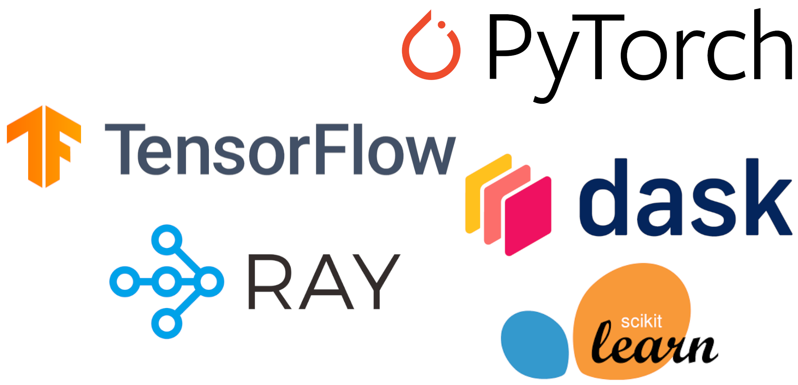
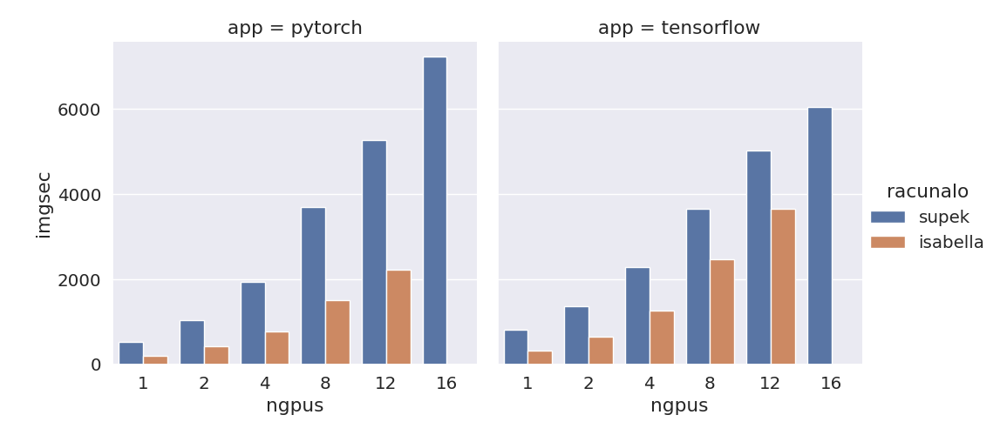
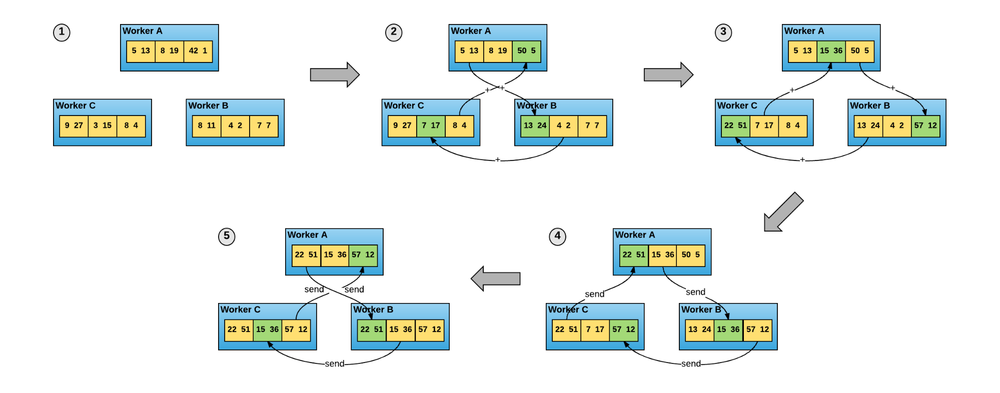
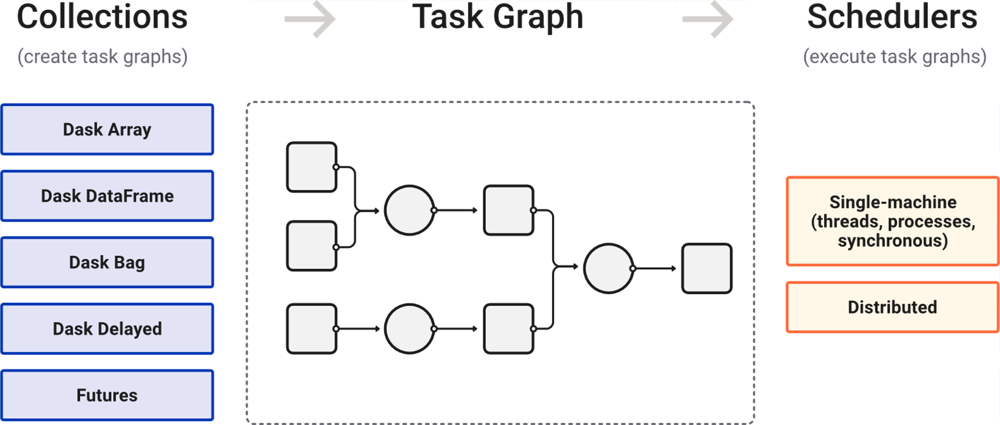
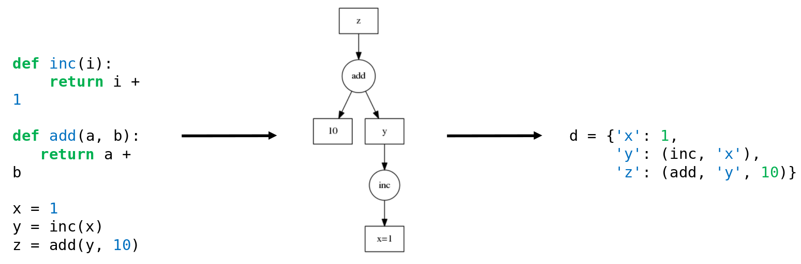
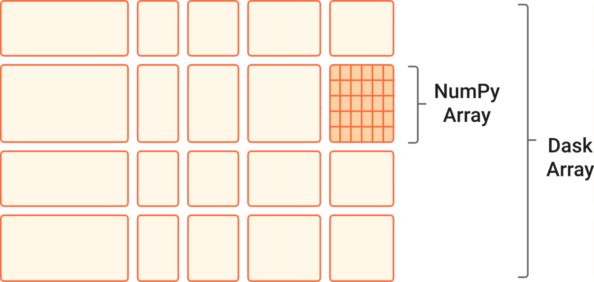
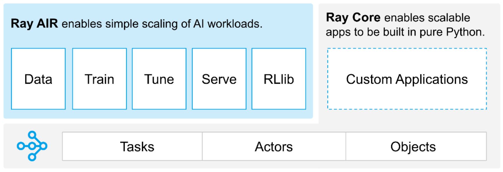
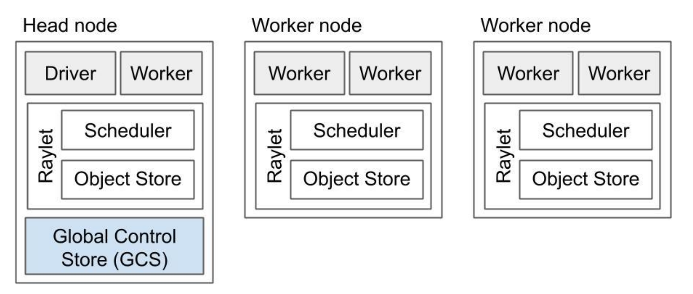
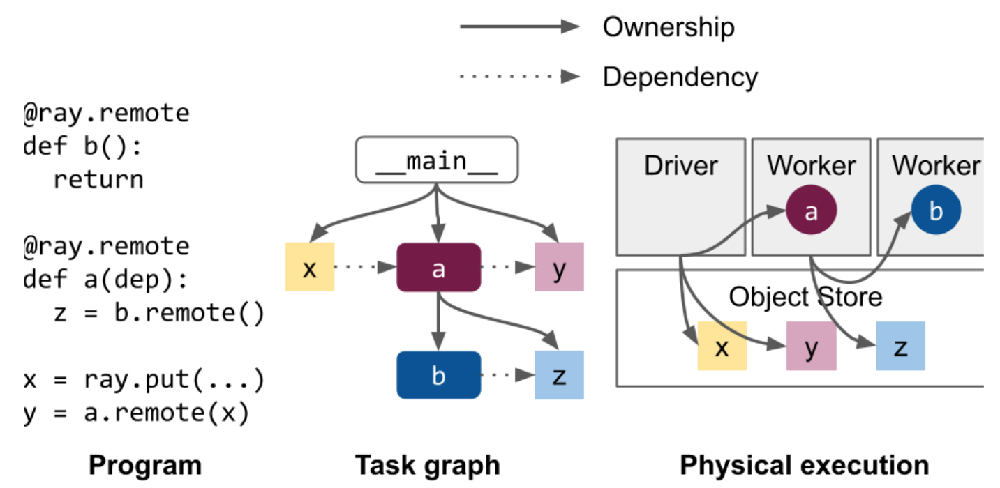

## Sadržaj

- Strojno učenje na Supeku
  - Aplikacije i performanse
  - Python i Lustre
  - Implementacija

- Primjeri
  - TensorFlow
  - PyTorch
  - Scikit-learn & Dask
  - Ray

# Strojno učenje na Supeku

## Aplikacije

:::::::::::::: {.columns}
::: {.column width="50%"}

- NVIDIA NGC
    - kontejneri optimizari za izvođenje na GPU
- Trenutne
    - TensorFlow 2.10.1
    - PyTorch 1.8.0, 1.14.0 i 2.0.0
    - Dask 2023.7.0
    - Scikit-learn 0.24.1-2, 1.2.2, 1.30
    - Ray 2.4.0
- U izradi
    - Horovod
    - Rapids
    - Lightning AI

:::
::: {.column width="50%"}


<!-- Trenutne aplikacije strojnog učenja -->

:::
::::::::::::::

## Performanse - Resnet50


<!-- Brzina treniranja modela ResNet50 [img/sec] korištenjem PyTorcha (lijevo) i TensorFlowa (desno) na klasteru Supek (plavo) i Isabella (narančasto) -->

## Implementacija

:::::: {.columns}

::: {.column width="50%"}
- Modulefiles
    - **`$IMAGE_PATH`** - definicija staze kontejnera
    - **`$PATH`** - dodavanje wrapper
- Wrapperi
    - Izvršne shell skripte koje osiguravaju integraciju s PBS-om
- Više inačica ovisno o potrebama
    - **`run-singlenode.sh`** - TensorFlow na jednom čvoru
    - **`torchrun-multinode.sh`** - PyTorch na više čvorova
    - **`dask-launcher.sh`** - Dask klaster
:::

::: {.column width="50%" align=bottom}

```sh
#PBS -l ngpus=1
#PBS -l ncpus=8
module load scientific/tensorflow
run-singlenode.sh moja-skripta.py
```

:::

::::::

## NCCL

:::::::::::::: {.columns}
::: {.column width="50%"}

- ["Data parallel" problem](https://siboehm.com/articles/22/data-parallel-training)
    - Usklađivanje gradijenata na više procesora tijekom backpropa
- NCCL
    - NVIDIA MPI
    - NVLink - 600GB/s
- [AllReduce](https://marek.ai/allreduce-the-basis-of-multi-device-communication-for-neural-network-training.htm)
    - Ring & Tree

:::
::: {.column width="50%"}


<!-- Ring AllReduce algoritam (Figure 4. u [izvoru](https://www.uber.com/en-HR/blog/horovod/))-->

:::
::::::::::::::

# Primjeri

## Priprema

:::::: {.columns}
::: {.column width="50%"}
- Primjeri
  - TensorFlow & PyTorch
  - Scikit-learn & Dask
  - Ray Train & Tune
- Priprema/git
  - [mkvakic/snr-ml-primjeri](https://github.com/mkvakic-srce/snr-ml-primjeri)
:::
::: {.column width="50%"}

```sh
[korisnik@x3000c0s25b0n0 ~]$ git clone git@github.com:mkvakic-srce/snr-ml-primjeri.git
Cloning into 'snr-ml-primjeri'...
...

[korisnik@x3000c0s25b0n0 ~]$ cd snr-ml-primjeri

[mkvakic@x3000c0s25b0n0 snr-ml-primjeri]$ ls -1
README.md
...
```
:::
::::::

## TensorFlow

:::::: {.columns}
::: {.column width="50%"}
- Zadano ponašanje
    - 1 GPU
- Distribuirani proračun
    - korištenjem "strategija"
    - kompilacija modela unutar djelokruga (*scopea*)
- Strategije
    - **`OneDeviceStrategy`**
    - **`MirroredStrategy`**
    - **`MultiWorkerMirroredStrategy`**
:::
::: {.column width="50%"}

```python
...
layers = [tf.keras.Input(10),
          tf.keras.layers.Dense(10),
          tf.keras.layers.Softmax()]

strategy = tf.distribute.MirroredStrategy()
with strategy.scope():
    model = tf.keras.Sequential(layers)
    model.compile()

model.fit(data)
...
```
:::
::::::

## TensorFlow na jednom GPU procesoru

```sh
#PBS -q gpu-radionica
#PBS -l ngpus=1

module load scientific/tensorflow

cd ${PBS_O_WORKDIR:-""}

run-singlenode.sh tensorflow-singlegpu.py
```

## TensorFlow na više GPU procesora

```sh
#PBS -q gpu-radionica
#PBS -l select=2:ngpus=1

module load scientific/tensorflow

cd ${PBS_O_WORKDIR:-""}

run-multinode.sh tensorflow-strategy.py
```

## PyTorch

:::::: {.columns}
::: {.column width="50%"}
- Ručno postavljanje na procese/rangove

- `torchrun`
    - izvorno sučelje
    - implementacija slična MPI

- `accelerate`
    - HuggingFace sučelje
    - viši nivo apstrakcije
:::
::: {.column width="50%"}

```python
...
torch.distributed.init_process_group('nccl')
local_rank = int(os.environ['LOCAL_RANK'])

model = torchvision.models.resnet50()
model = model.to(local_rank)

for input, output in dataloader:
    optimizer.zero_grad()
    predicted = model(input)
    loss = loss_fn(predicted, output)
    loss.backward()
    optimizer.step()
...
```

:::
::::::

## PyTorch na jednom GPU procesoru

```sh
#PBS -q gpu-radionica
#PBS -l ngpus=1

module load scientific/pytorch

cd ${PBS_O_WORKDIR:-""}

run-singlegpu.sh pytorch-singlegpu.py
```

## PyTorch na više GPU procesora

```sh
#PBS -q gpu-radionica
#PBS -l select=2:ngpus=1

module load scientific/pytorch

cd ${PBS_O_WORKDIR:-""}

torchrun-multinode.sh pytorch-torchrun.py
```

## Dask

:::::: {.columns}
::: {.column width="50%"}
- Namijenjeno paralelizaciji Python koda i distribuiranoj obradi OOM podataka
- Razlaganje programa na jednostavne operacije korištenjem **dask** grafova
- Komponenete
    - `Array` - tenzori
    - `DataFrame` - strukturirani podaci
    - `Bag` - nizovi
    - `Delayed` - custom funkcije
    - `Futures` - eager `Delayed`
:::
::: {.column width="50%"}


<!-- Trenutne aplikacije strojnog učenja -->

:::
::::::

## Dask grafovi

{height=100px}
<!-- Osnovni graf Dask ([Izvor](https://docs.dask.org/en/latest/graphs.html)) -->

## Dask OOM

{height=100px}
<!-- Distribucija podataka na klasteru Dask u slučaju Dask Arraya [izvor](https://docs.dask.org/en/stable/array.html#design) -->

## Scikit-learn putem threadinga

```sh
#PBS -q cpu-radionica
#PBS -l select=1:ncpus=16

module load scientific/dask

cd ${PBS_O_WORKDIR:-""}

$IMAGE_PATH python sklearn-threads.py
```

## Scikit-learn na više čvorova

```sh
#PBS -q cpu-radionica
#PBS -l select=2:ncpus=8:mem=50GB

module load scientific/dask

cd ${PBS_O_WORKDIR:-""}

dask-launcher.sh sklearn-dask.py
```

## Dask na više čvorova

```sh
#PBS -q cpu-radionica
#PBS -l select=2:ncpus=8:mem=75GB

module load scientific/dask

cd ${PBS_O_WORKDIR:-""}

dask-launcher.sh sklearn-dask-dask.py
```

## Ray

:::::: {.columns}
::: {.column width="50%"}
- Originalno
    - Distribuirano ojačano učenje
- Komponente
    - Ray Core - osnovne komponente
    - Ray Air - distribucija ML
    - Ray Ecosystem - prilagodba postojećim knjižnicama ML
- Ray Core
    - Tasks - funkcije
    - Actors - klase
    - Objects - varijable
:::
::: {.column width="50%"}


<!-- Ray komponente [izvor](https://docs.google.com/document/d/1tBw9A4j62ruI5omIJbMxly-la5w4q_TjyJgJL_jN2fI/edit#heading=h.iyrm5j2gcdoq)-->

:::
::::::

## Ray klaster

:::::: {.columns}
::: {.column width="50%"}
- Head čvor
    - Driver - glavni program
    - Global Control Store - koordinacija klastera
- Worker čvorovi
    - Worker - izvršavanje zadataka i "posjedovanje" referenci
- Raylet
    - koordinacija lokalnih resursa
    - Scheduler - raspoređivanje
    - Object Store - pohrana
:::
::: {.column width="50%"}


<!-- Shema Ray klastera (Figure 2-3 u [izvoru](https://www.oreilly.com/library/view/learning-ray/9781098117214)) -->

:::
::::::

## Ray reference i izvođenje programa


<!--  Shema Ray posjedovanja i izvršavanja (Ownership, str. 8 u [izvoru](https://docs.google.com/document/d/1tBw9A4j62ruI5omIJbMxly-la5w4q_TjyJgJL_jN2fI/edit))-->

## Ray Train i PyTorch

```sh
#PBS -q gpu-radionica
#PBS -l select=2:ngpus=1:ncpus=4

module load scientific/ray

cd ${PBS_O_WORKDIR:-""}

ray-launcher.sh pytorch-ray-train.py
```

## Ray Tune i TensorFlow

```sh
#PBS -q gpu-radionica
#PBS -l select=2:ngpus=1:ncpus=4

module load scientific/ray

cd ${PBS_O_WORKDIR:-""}

ray-launcher.sh tensorflow-ray-tune.py
```
